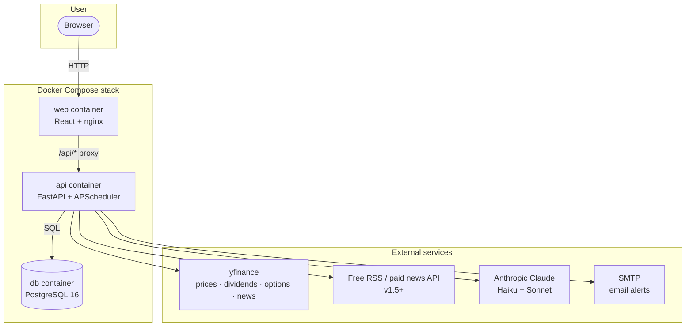
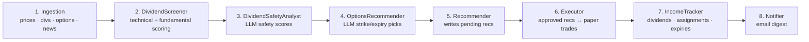
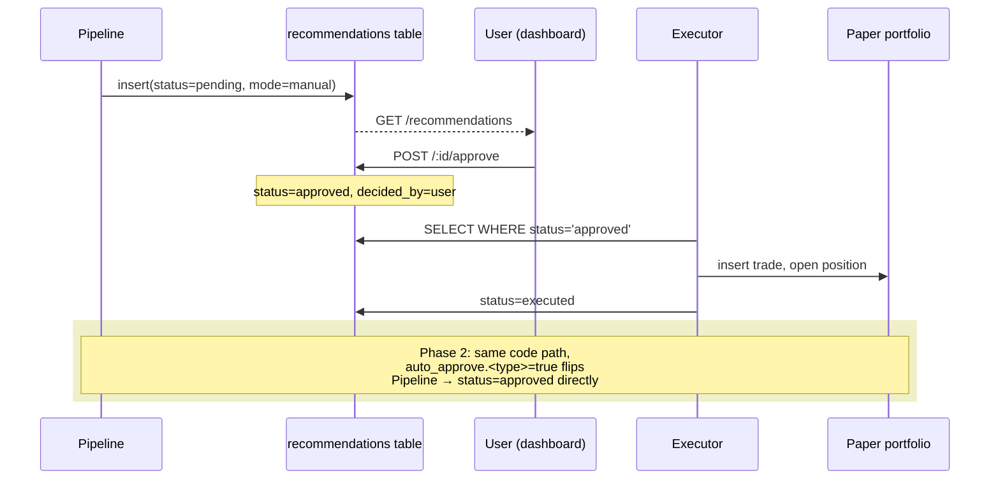
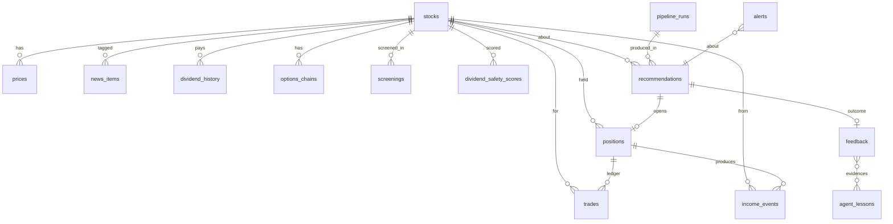

# Stock Income Agent

A personal, self-hosted agent that generates **recurring monthly income** from a paper-traded (later real) S&P 500 portfolio, using a **dividend portfolio + covered-call writing** strategy. The agent ingests market data, news, and fundamentals; produces concrete recommendations; simulates trades; tracks realized income over time; and learns from outcomes.

Full design: [`docs/superpowers/specs/2026-05-28-stock-income-agent-design.md`](docs/superpowers/specs/2026-05-28-stock-income-agent-design.md).

---

## Product goals

### Primary goal
Generate predictable **monthly income** (dividends + covered-call premiums) from S&P 500 stocks, with a human-in-the-loop approval workflow in Phase 1 and an explicit seam to enable auto-execution in Phase 2.

### Why income, not capital appreciation
Predicting which stocks will rise short-term is dominated by institutional investors with structural advantages. **Income strategies** play to LLM strengths — synthesizing fundamentals, flagging deterioration, scoring sustainability — and produce more predictable, measurable outcomes.

### Specific goals
1. **Curate** a high-quality dividend portfolio (Aristocrats, Kings, monthly payers; safe payout ratios; FCF coverage).
2. **Recommend** monthly covered-call sales on holdings to earn premium income, with explicit strike/expiration choices.
3. **Track** every dividend payment, premium received, and assignment as a discrete, append-only income event.
4. **Benchmark** honestly against SPY total return and 1-month Treasury yields — no hidden underperformance.
5. **Learn** weekly from closed positions and user feedback; visible, falsifiable lessons injected into next week's analysis prompts.
6. **Stay local & cheap**: ~$5/month runtime, runs entirely on a laptop via Docker Compose, no auth, no cloud dependency.

### Success criteria
| Criterion | Target |
|---|---|
| Pipeline reliability | Runs every weekday evening; failures isolated per ticker |
| Honest reporting | Every chart shows SPY total return + 1-month Treasury baseline |
| Dividend safety accuracy | ≥60% of high-confidence safety scores correctly predict continuity (after 3 months) |
| Covered-call success | ≥70% of calls expire worthless or assign at modest gain |
| Learning loop | `agent_lessons` accumulates falsifiable patterns with sample size ≥5 |
| Steady-state cost | ≤ $15/month including LLM tokens |

---

## Honest probabilities

Documented up front so future-me does not forget what was realistic at design time.

| Outcome | Estimated probability |
|---|---|
| System works as designed (reliable pipeline, functional dashboard) | **~90%** |
| Agent produces *some* monthly income on real capital later | **~85–95%** |
| Agent's strategy beats SPY total return over 1 year | **~30–40%** |
| Strategy survives a 30% market crash with income mostly intact | **~60–70%** |
| User makes meaningful absolute money relative to time invested | depends primarily on capital deployed, not the agent |

The asymmetry is favorable: **worst case** is ~$30–75 spent and 3 months learning a lot; **best case** is a useful income tool that runs for years.

---

## Architecture

### High-level



**Approach:** Monolithic FastAPI service contains scheduler, ingestion, scoring, LLM orchestration, paper-portfolio logic, and REST API. Postgres is the single source of truth. React frontend is served by nginx and proxies `/api/*` to the backend.

**Stack:** Python 3.12 · FastAPI · SQLAlchemy 2.x (async) · Alembic · pydantic-settings · React 18 · Vite · TypeScript · TanStack Query · PostgreSQL 16 · Docker Compose.

### Daily pipeline

Runs weekdays at 17:15 ET via APScheduler:



A separate **weekly Learner** runs Fridays after the regular pipeline: reviews closed positions, generates new lessons (gated by sample size ≥ 5), and updates the active lessons injected into next week's prompts.

### Decision → Execution split (Phase 1 → Phase 2 seam)



The Pipeline and Executor are coupled only through the `recommendations` table. Phase-2 auto-execution is a config flag flip, not a code change.

### Data model

14 tables, organized by domain:



Key principles:
- **`trades` and `income_events` are append-only** — positions and P&L are derived state. The ledgers are authoritative.
- **`recommendations` are immutable** after creation; only `status` and `decided_at` change.
- Every recommendation carries `signals_snapshot` and `llm_prompt_version` so the learning loop can reason about exactly what produced each pick.

---

## REST API

All endpoints are prefixed `/` on the api container (port 8000); the React frontend reaches them via `/api/*` (nginx proxy in prod, Vite proxy in dev).

> **Status:** Only `/health` exists today (Foundation sub-project). The rest of these endpoints land in subsequent sub-projects per the plan.

### Health & ops

| Method | Path | Status | Description |
|---|---|---|---|
| `GET` | `/health` | ✅ implemented | Liveness + DB ping. Returns 200 `{"status":"ok","database":"ok"}` or 503 `{"status":"degraded","database":"down"}` |
| `GET` | `/pipeline/runs` | planned | Last 30 pipeline runs with status, duration, errors |
| `POST` | `/pipeline/run?step=<name>` | planned | Manually trigger an individual step (debugging) |

### Stocks & data

| Method | Path | Description |
|---|---|---|
| `GET` | `/stocks` | List universe (S&P 500); filter by sector, dividend status |
| `GET` | `/stocks/{ticker}` | Stock detail + latest signals |
| `GET` | `/stocks/{ticker}/prices?from=&to=` | OHLCV history |
| `GET` | `/stocks/{ticker}/dividends` | Dividend history |
| `GET` | `/stocks/{ticker}/news?limit=` | Recent news for ticker |
| `GET` | `/stocks/{ticker}/safety-score` | Latest LLM safety score + reasoning |

### Recommendations

| Method | Path | Description |
|---|---|---|
| `GET` | `/recommendations?status=&type=` | List recs, default `status=pending` |
| `GET` | `/recommendations/{id}` | Full rec with reasoning + signals snapshot |
| `POST` | `/recommendations/{id}/approve` | User approves (Phase 1) |
| `POST` | `/recommendations/{id}/reject` | User rejects with optional reason text |

### Portfolio

| Method | Path | Description |
|---|---|---|
| `GET` | `/portfolio/live` | Current positions with mark-to-market P&L (2-min price cache) |
| `GET` | `/portfolio/holdings` | Open positions + yields + safety scores |
| `GET` | `/portfolio/income?from=&to=` | Income events in range |
| `GET` | `/portfolio/income/calendar?days=30` | Next-N-days projected income |
| `GET` | `/portfolio/performance` | YTD return vs. SPY total return vs. 1-mo Treasury |

### Trades & history

| Method | Path | Description |
|---|---|---|
| `GET` | `/trades?from=&to=` | Append-only ledger |
| `GET` | `/positions?status=` | Open and closed positions |
| `GET` | `/positions/{id}` | Position with full trade history + feedback |

### Learning

| Method | Path | Description |
|---|---|---|
| `GET` | `/lessons?active=true` | Current `agent_lessons` injected into prompts |
| `POST` | `/lessons/{id}/ignore` | User toggles a lesson off |
| `GET` | `/feedback?from=&to=` | Closed-position post-mortems |

### Settings

| Method | Path | Description |
|---|---|---|
| `GET` | `/settings` | Current config (approval modes, safety rails, notification prefs) |
| `PATCH` | `/settings` | Update config (e.g., flip `auto_approve.sell_covered_call`) |
| `POST` | `/settings/kill-switch` | Immediately revert all auto-approval to manual |

### Response shapes

All responses are JSON. Errors follow:

```json
{ "error": { "code": "string", "message": "human readable", "details": {} } }
```

Validation errors return HTTP 422 with `details` listing the failing fields (FastAPI default).

---

## Local development

```bash
cp .env.example .env.local
# Edit .env.local; at minimum set POSTGRES_PASSWORD to something other than `changeme`.

make up         # build + start all containers
make logs       # follow logs
```

Then visit:
- Dashboard: <http://localhost:3000>
- API:       <http://localhost:8000>
- Health:    <http://localhost:8000/health>

### Common commands

```bash
make up                  # start
make down                # stop
make test                # run all tests (backend + frontend)
make test-backend        # backend only (pytest + testcontainers)
make test-frontend       # frontend only (vitest)
make lint                # ruff + eslint
make migrate             # apply alembic migrations
make shell-api           # bash inside api container
make shell-db            # psql inside db container
```

### Project structure

```
backend/
  app/
    api/             # HTTP endpoints (one file per resource)
    models/          # SQLAlchemy models
    config.py        # pydantic-settings
    db.py            # async engine + sessions
    main.py          # FastAPI app factory
  alembic/           # migrations
  tests/             # pytest + testcontainers
frontend/
  src/
    api/             # typed API client modules
    App.tsx
    main.tsx
  tests/             # vitest + Testing Library
docs/
  superpowers/
    specs/           # design docs
    plans/           # implementation plans (per sub-project)
docker-compose.yml
Makefile
```

---

## Phasing

| Phase | Status | What's in it |
|---|---|---|
| **1. Foundation** | 🟡 in progress | Containerized stack, FastAPI + Postgres + React skeleton, `/health` endpoint, Alembic infra, CI |
| **2. Data ingestion** | planned | yfinance prices/dividends/options + news RSS; daily pipeline shell |
| **3. Analysis & recommendations** | planned | DividendScreener, DividendSafetyAnalyst LLM, OptionsRecommender LLM, Recommender |
| **4. Paper trading & income tracking** | planned | Executor, IncomeTracker, full dividend + covered-call simulation, feedback |
| **5. Dashboard & learning loop** | planned | All 5 React tabs wired, weekly Learner, alerts/notifier |
| **Phase 2 (later)** | designed-in | Auto-approval per rec type, safety rails enforcement, kill switch |
| **Phase 3 (later)** | out of scope | Real broker integration (Alpaca / IBKR), live trading |

Each sub-project has its own implementation plan in `docs/superpowers/plans/`.

---

## Cost estimates

**Build:** ~3 months calendar (evenings/weekends); ~$15–75 in LLM tokens during development.

**Runtime (steady state):**
- LLM (Haiku routine + Sonnet weekly learner): ~$2–5/month
- Data feeds: $0 with free yfinance + RSS; +$30/month if paid news API added in v1.5
- Hosting: $0 local; ~$10–30/month if later moved to cloud
- **Total v1 runtime: ~$5/month**

---

## Disclaimer

This is a **personal research project**. Nothing here is investment advice. The agent makes mistakes. Paper trading exists precisely so the agent has to prove itself before any real money is risked. The probability estimates above reflect honest expectations, not promises.
